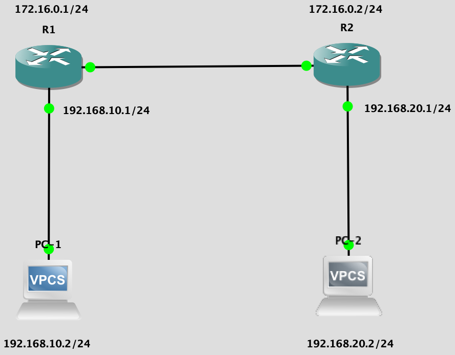

## Static route

Имеем сеть из роутеров `r1`, `r2` и клиентских машин `pc1` и `pc2`.



#### Настройка статической маршрутизации

```
PC-1$ ip 192.168.10.2 255.255.255.0 192.168.10.1

PC-2$ ip 192.168.20.2 255.255.255.0 192.168.20.1

R1# conf t
R1# int fa0/1
R1# ip address 192.168.10.1 255.255.255.0
R1# no shutdown
R1#
R1# int fa0/0
R1# ip address 172.16.0.1 255.255.255.0
R1# no shutdown
R1#
R1# ip route 192.168.20.0 255.255.255.0 fa0/0 172.16.0.2
R1# exit
R1# wr mem

R2# conf t
R2# int fa0/1
R2# ip address 192.168.20.1 255.255.255.0
R2# no shutdowns
R2#
R2# int fa0/0
R2# ip address 172.16.0.2 255.255.255.0
R2# no shutdown
R2#
R2# ip route 192.168.10.0 255.255.255.0 fa0/0 172.16.0.1
R2# exit
R2# wr mem
```

```
Настройка ip на компьютере PC-1: адрес машины, маска подсети, default gateway

--//-- PC-2 --//--

Вход в терминал конфигурации CISCO роутера R1
Выбор интерфейса fa0/1
Установка ip: адрес, маска подсети
Включение интерфейса fa0/1
Выбор интерфейса fa0/0
Установка ip
Включение интерфейса fa0/0
Перенаправления пакетов для адреса 192.168.20.0 с маской 255.255.255.0 на интерфейс fa0/0, адрес 172.16.0.2
Выход из терминала конфигурации
Сохранение конфигурации CISCO

--//-- R2 --//--

```

`Startup config` и `running config` - два вида конфигураций на роутерах CISCO. `Startup` хранится на энергонезависимом носителе и будет загружен после перезагрузки, `running` - текущая работающая конфигурация. `wr mem` записывает `running` в `startup`.

#### Проверка работоспособности

```
PC-1$ ping 192.168.20.2 -c4
PC-2$ ping 192.168.10.2 -c4
```

#### Отключение статической маршрутизации

```
R2# no ip route 192.168.10.0 255.255.255.0 fa0/0 172.16.0.1
```