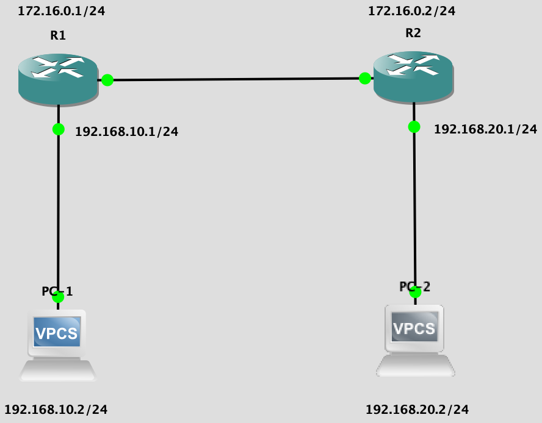
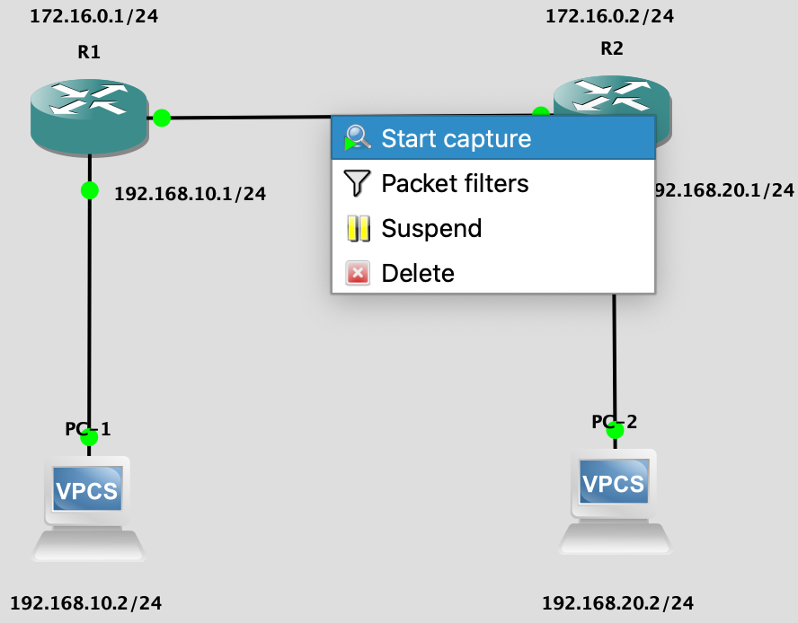
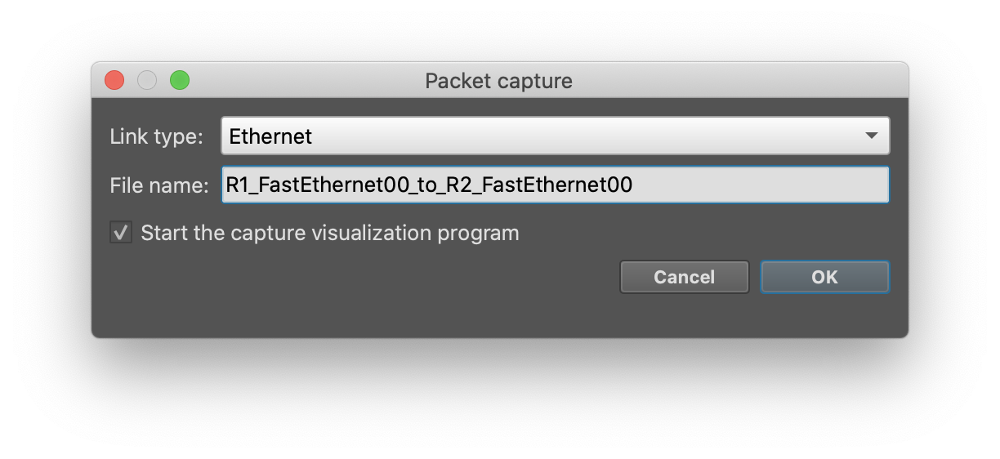
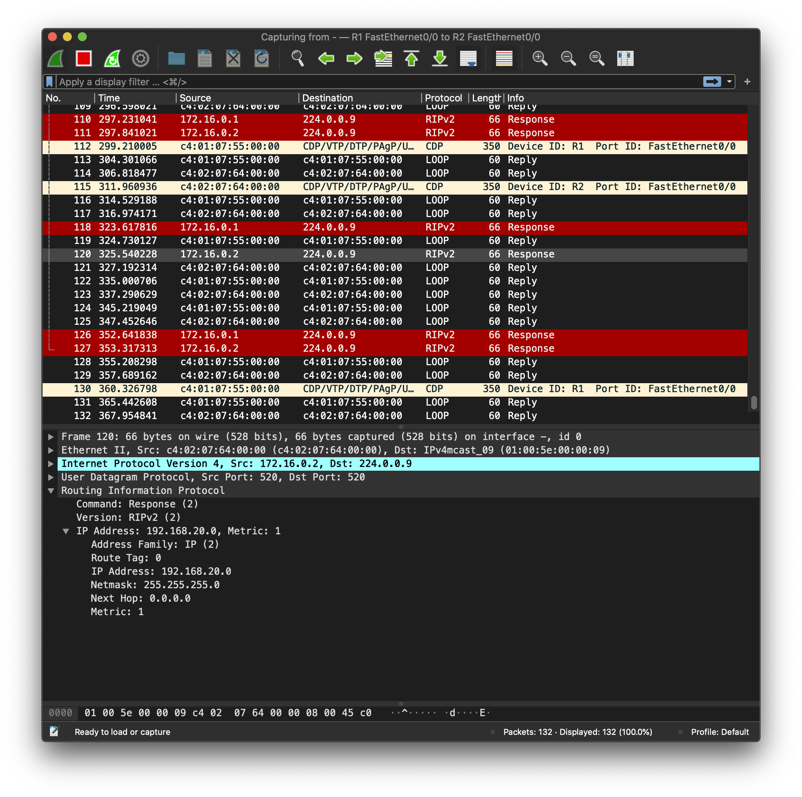

## Динамическая маршрутизация с использованием [RIP](https://www.cisco.com/c/en/us/td/docs/ios/iproute_rip/command/reference/irr_book/irr_rip.html)

Физическая конфигурация сети аналогична демо статической маршрутизации.



#### [Настройка динамической маршрутизации](https://www.computernetworkingnotes.com/ccna-study-guide/rip-protocol-configuration-guide-with-examples.html#:~:text=router%20rip%20command%20tell%20router,directly%20connected%20with%20the%20router.)

Не забудьте отключить `ip route` для статической маршрутизации, если таковые были настроены ранее.

```
R1# conf t
R1# router rip
R1# network 192.168.10.0
R1# network 172.16.0.0
R1# version 2
R1# no auto-summary
R1# exit
R1# exit

R2# conf t
R2# router rip
R2# network 192.168.20.0
R2# network 172.16.0.0
R2# version 2
R2# no auto-summary
R2# exit
R2# exit
```

```
conf t для R1
Настройка RIP
Указание сети для 'рекламирования' ()
Указание ещё сети для 'рекламирования'
Выбор версии протокола (2-я позволяет работать без классовых сетей)
Использоваание масок подсети, а не классовых подсетей

--//-- R2 --//--
```

#### Проверка

`PC-1$ ping 192.168.20.2` или `PC-1$ trace  192.168.20.2` для просмотра L3-пути до другой машины.

`R1# show ip route`

## [Wireshark](https://www.wireshark.org/download.html)





