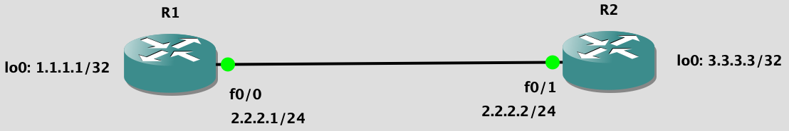

## [BGP](https://www.cisco.com/c/en/us/td/docs/ios-xml/ios/iproute_bgp/configuration/xe-16/irg-xe-16-book/configuring-a-basic-bgp-network.html)



#### Первоначальная настройка роутеров

R1:

```
conf t
int lo0
ip addr 1.1.1.1 255.255.255.255
no shutdown

int fa0/0
ip addr 2.2.2.1 255.255.255.0
no shutdown
```

R2:

```
conf t
int lo0
ip addr 3.3.3.3 255.255.255.255
no shutdown

int fa0/1
ip addr 2.2.2.2 255.255.255.0
no shutdown
```

#### Нстройка [BGP](https://www.cisco.com/c/en/us/td/docs/ios-xml/ios/iproute_bgp/configuration/xe-16/irg-xe-16-book/configuring-a-basic-bgp-network.html)

R1:

```
router bgp 1
network 1.1.1.1 mask 255.255.255.255
neighbor 2.2.2.2 remote-as 2
```

```
Подъём и настройка BGP, autonomous-system-number == 1
Добавялем сеть loopback'а
Добавляем сессию с соседом с ip адресом, AS 2
```

R2:

```
router bgp 2
network 3.3.3.3 mask 255.255.255.255
neighbor 2.2.2.1 remote-as 1
```

#### Изменим топологию сети


#### Донастройка сети

R2:

```
int fa0/1
ip addr 6.6.6.1 255.255.255.0
no shutdown

int fa0/0
ip addr 4.4.4.1 255.255.255.0
no shutdown
```

R3:

```
conf t
int lo0
ip addr 5.5.5.5 255.255.255.255
no shutdown

int fa0/1
ip addr 4.4.4.2 255.255.255.0
no shutdown
```

R4:

```
conf t
int lo0
ip addr 7.7.7.7 255.255.255.255
no shutdown

int fa0/1
ip addr 6.6.6.2 255.255.255.0
no shutdown
```

#### Донастройка BGP

R2:

```
router bgp 2
neighbor 4.4.4.2 remote-as 3
neighbor 6.6.6.2 remote-as 2
```

R3:

```
router bgp 3
network 5.5.5.5 mask 255.255.255.255
neighbor 4.4.4.1 remote-as 2
```

R4:

```
router bgp 2
neighbor 6.6.6.1 remote-as 2
network 7.7.7.7 mask 255.255.255.255
```

На данном этапе по `show ip bgp` и `show ip route` можно посмотреть на рекламируемые и доступные сети. Однако `ping 4.4.4.2` на R2 не выйдет, потому что R2 не рекламирует подсеть `4.4.4.0`.

Доконфигурируем R2:
```
conf t
router bgp 2
network 2.2.2.0 mask 255.255.255.0
network 4.4.4.0 mask 255.255.255.0
network 6.6.6.0 mask 255.255.255.0
```

Теперь с R1 проходят пинги к `7.7.7.7` и `4.4.4.2`.

При настройке BGP нужно рекламировать все сети, которые доступны на данном роутере.