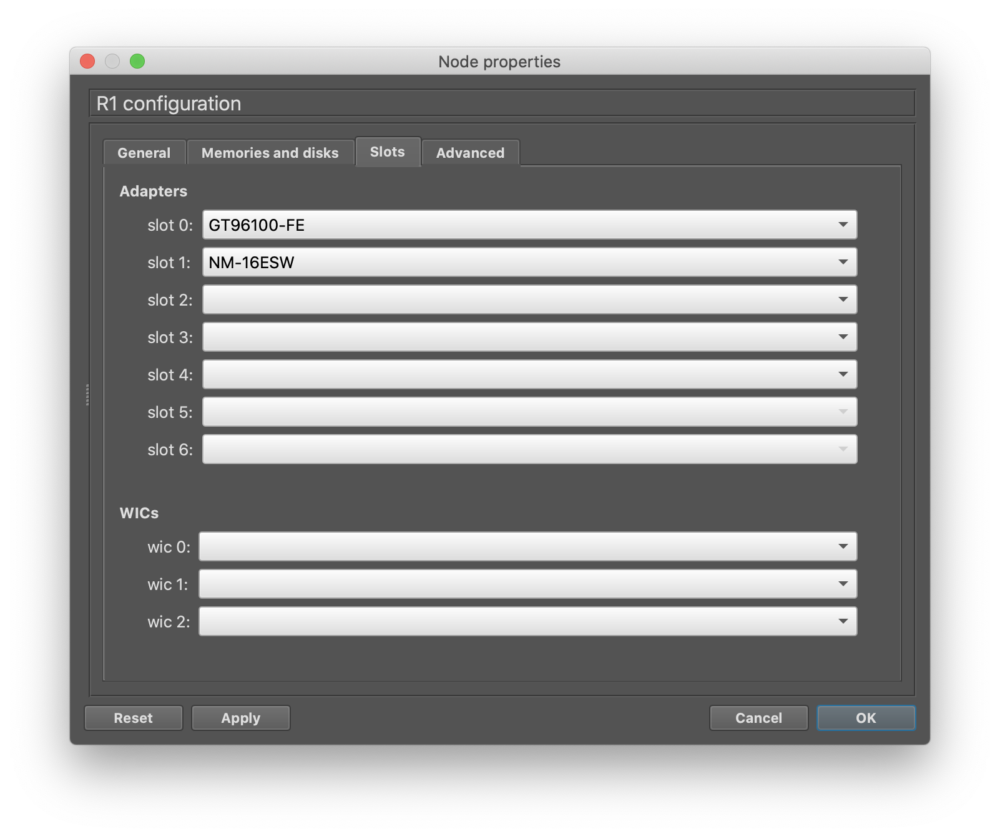
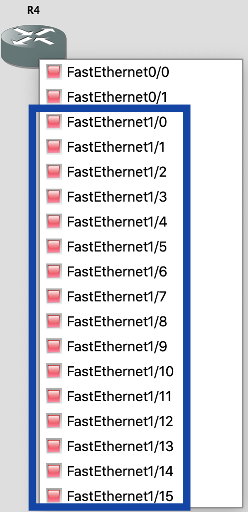
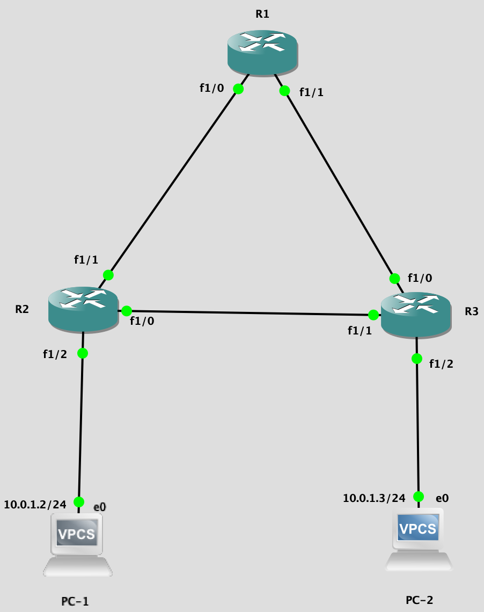

## STP

### Превращаем роутер в свич

Добавлялем в слот роутера `NM-16ESW`.



Для соединения роутеров-свичей используем интерфейсы из первого слота (ну, или разберётесь там, с какими интерфейсами работать), потому что именно на них будет работать switching.



### Добавление IOSwitch для любителей

1. Качаем по [ссылочке](https://drive.google.com/file/d/0B-v2VUXWowDLN1NYUFFQTWkyNW8/view) `i86bi-linux-l2-adventerprisek9-15.1.bin`
2. [Тут](https://www.systemconf.com/2019/01/03/generate-cisco-iourc-license-key-on-gns3-vm-using-python-3/) разбираемся, как добавить лицензию на IOS on Unix в GNS3
3. В IOS Devices добавляем новый свич, называем его, как хотим

### STP demo



PC-1:

```
ip 10.0.1.2/24 10.0.1.1
```

PC-2:

```
ip 10.0.1.3/24 10.0.1.1
```

По умолчанию, STP настраивать не нужно, он работает из коробки при включении  устройств.
По  `show spanning-tree brief` можно сразу в этом убедиться. Мы можем пинговать PC-1 ил PC-2, потому что сработал ARP.

### Продолжаем развлекаться

На каждом роутере выполним:

```
conf t
no spanning-tree vlan 1 
```

Посмотрим на то, что проходит по каналу R2-R1. Наблюдается засилие broadcast ARP пакетов.

### Ручное изменение настроек STP

`spanning-tree vlan 1 priority 10` - сильно понизили приоритет свича, он,  скорее всего, станет Bridge.

Управление стоимостью:
```
spanning-tree vlan 1 cost 3
```

Или же изменение стоимости на определённом интерфейсе:

```
int po1
spanning-tree cost 1000
```
 
