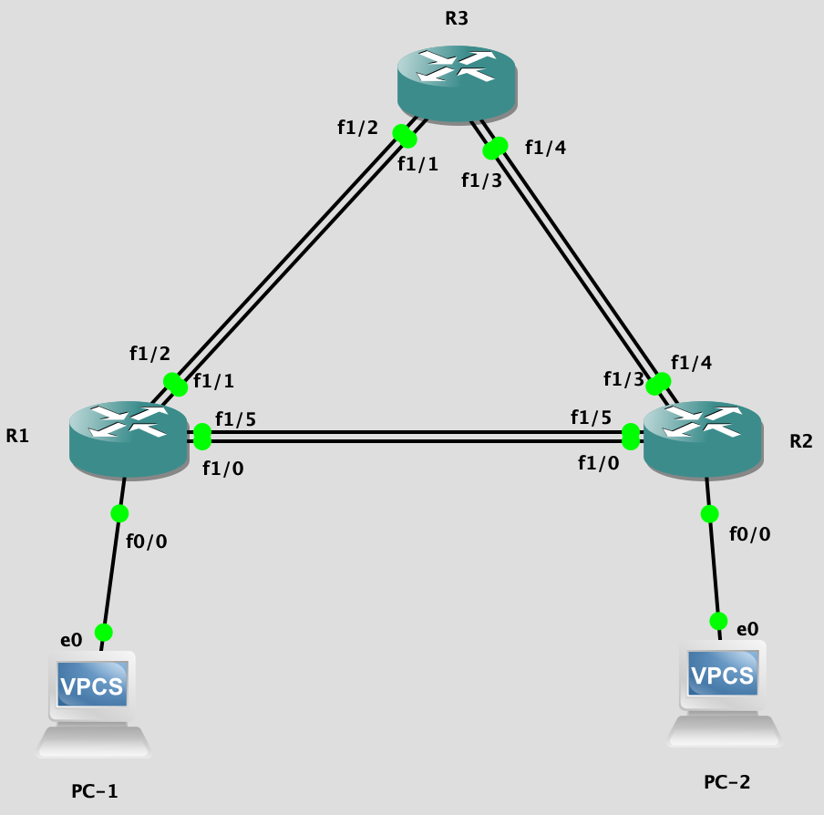

## EtherChannel

#### Настройка на роутере-свиче



Беглый `show spanning-tree vlan 1 brief` показывает, что есть дублирующие заблокированные интерфейсы.

R1:

```
int range fa1/1 , fa1/2
channel-group 1 mode on

int range fa1/0 , fa1/5
channel-group 2 mode on
```

```
Настравиваем сразу несколько интерфейсов
Выбираем режим EtherChannel
```

Номера групп не обязаны совпадать с двух сторон, главное правильно на каждой стороне объединить.
Ограничения роутера-свича: только Static On/On, разрыв одного соединения == всё падает.
