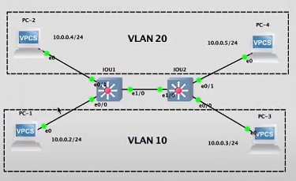
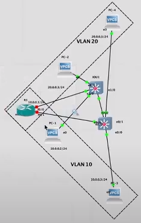
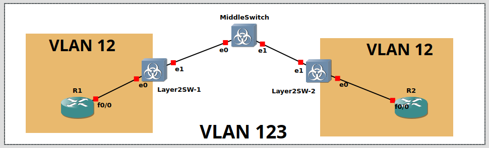

## VLAN demo

#### Топология 1 - звезда

НАстраиваем vlan'ы на свиче:

```
conf t

int range e0/0 - 1
switchport mode access
switchport access vlan 10

int range e1/0 - 1
switchport mode access
switchport access vlan 20
```

#### Топология 2



IOU1:
```
int e1/0
switchport trunk encapsulation dot1q
switchport trunk native vlan 99
switchport trunk allowed vlan 10,20
```

- Указываем использование 802.1Q (по сети смогут ходить пакеты с тегами)
- Пакеты без vlan будут оборачиваться в vlan 99
- Указываем vlan, с которыми будет работать trunk link

#### Топология 3 - Router on the stick



IOU1:

```
int e2/0
switchport mode access
switchport access vlan 10

int 
```

IOU2:

```
int e2/0
switchport mode access
switchport access vlan 20
```

Поднимаем порты на роутере R1.

#### Топология 4 с Q-in-Q



R1:
```
int fa0/0
no shutdown

int fa0/0.12
encapsulation dot1q 12
ip addr 10.0.0.1 255.255.255.0
```

R2:
```
int fa0/0
no shutdown

int fa0/0.12
encapsulation dot1Q 12
ip addr 10.0.0.2 255.255.255.0

```

Middle Switch:
```
conf t
vlan 123
exit

int range g0/1 - 2
switchport trunk encapsulation dot1Q
switchport mode trunk
```

Switch-1:
```
conf t

int g0/1
switchport trunk encapsulation dot1q
swichport mode trunk

int g0/0
switchport access vlan 123
switchport mode dot1q-tunnel
```

Switch-2:
```
conf t

int g0/1
switchport trunk encapsulation dot1q
swichport mode trunk

int g0/0
switchport access vlan 123
switchport mode dot1q-tunnel
```