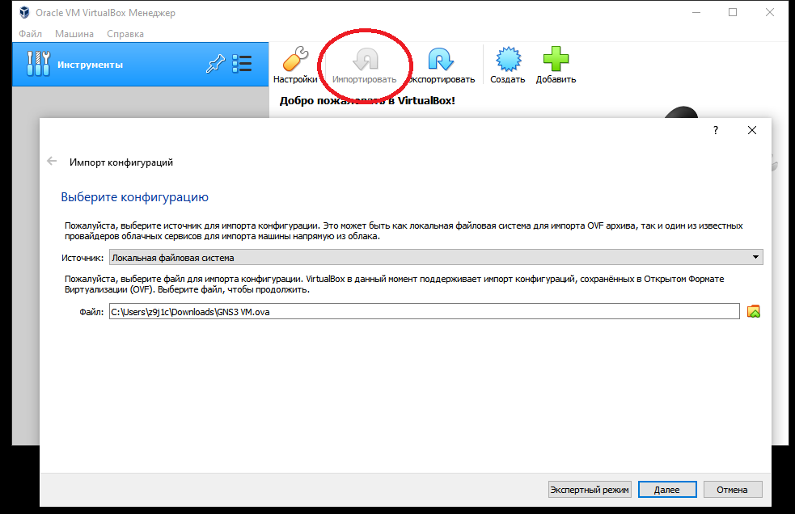
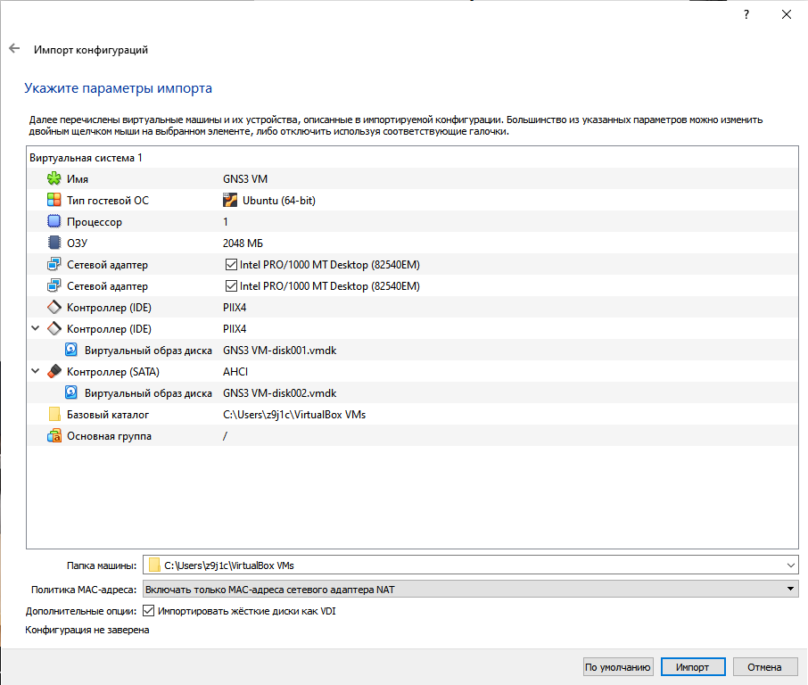
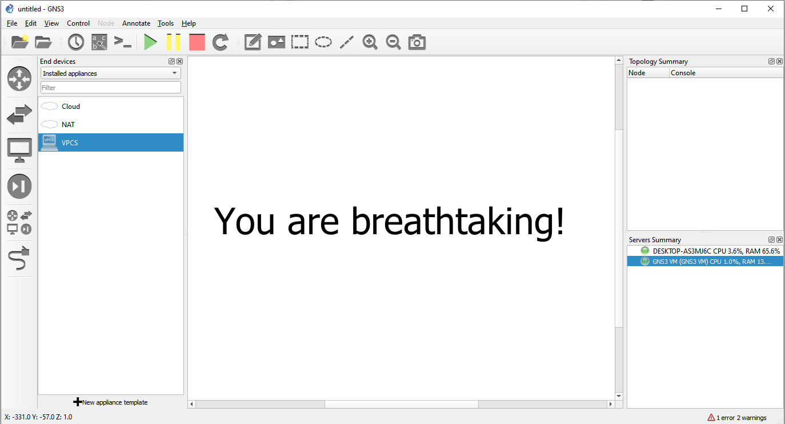

## Установка GNS3 на Windows 10 (20H2)

1. Ставим GNS3 (можно обратить внимание на сайт [freesoft.ru](https://freesoft.ru/))
2. Ставим [Virtual Box](https://www.virtualbox.org/wiki/Downloads) (на момент написания это документа последняя версия - `6.1.16`)
3. Загружаем образ той же версии, что и GNS3 для VB с [гитхаба](https://github.com/GNS3/gns3-gui/releases) (очень вероятно, что это версия [__2.1.21__](https://github.com/GNS3/gns3-gui/releases/tag/v2.1.21))
4. Достаём образ *.ova из архива, выбираем его для импорта в VB, соглашаемся с предустановленными настройками и импортируем.

5. Идём в `настройки` импортированной виртуальной машины > `Сеть` > `Адаптер 1`. Меняем тип адаптера на `virtio-net`.
6. Если после запуска вываливает ошибка "Failed to open/create the internal network 'HostInterfaceNetworking-VirtualBox Host-Only Ethernet Adapter' (VERR_INTNET_FLT_IF_NOT_FOUND).", то
то нужно переустановить VB с параметром `-msiparams NETWORKTYPE=NDIS5` (не забываем стартовать файл установки из-под админа). Происходит это из-за криво вставшего в первый раз `NDIS6`.

7. Ставим [VIX-API](https://my.vmware.com/web/vmware/downloads/details?downloadGroup=PLAYER-1400-VIX1170&productId=687) от VMware
8. Запускаем виртуалку, открываем GNS3.
8. При первом запуске GNS3 можно не менять дефолтные настройки (у меня с ними всё ок). На каждом шаге Setup Wizard может тупить, долго тупить.
9. Если Setup Wizard не стартовал сам, то запускаем его из Help'а, чтобы GNS3 нашёл запущенную виртуалку. 

10. Качаем образа роутеров `c3745` и `c7200` (ищи ссылку в презентации), ставим каждый из них в GNS3: Preferences > IOS Routers > New > "Run ... on GNS3 VM".
Проходим по цепочке next'ов, при появлении, жмём Idle-PC finder и соглашаемся с тем, что он нам предложит.

